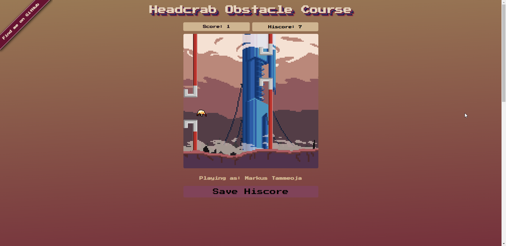
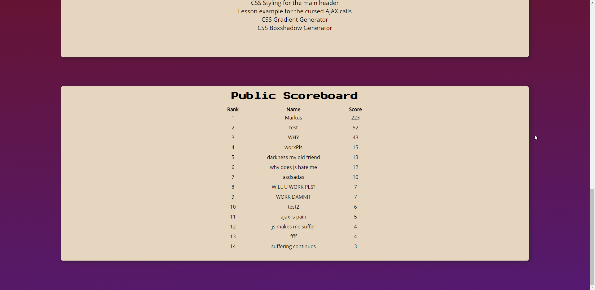
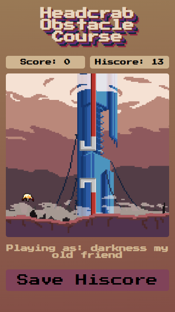

# Markus Tammeoja

Olen koostanud väikse Flappy Bird-laadse mängu. Võttis palju rohkem aega, kui arvasin, aga LÕPUKS sain siiski tööle (async JS tund oleks väga kasulik :D)

Kõik resurssi allikad on mängu veebilehel. Mõned joonistasin ise (raudkang).

### Live lingid:
- [Täisversioon](http://greeny.cs.tlu.ee/~tammeoja/informaatika/eesrakendused/2-kodutoo/) - vajab TLU greeny sissepääsu
- [Offline-versioon](http://www.tlu.ee/~dr1nky/headcrabcourse/) - Ilma edetabelita, AJAX puudub, tunnel ebavajalik

### Funktsionaalsus

- Mäng töötab
- Pausi funktsioon
- Tulemus salvestatud ketasse
- Soovi korral tulemus salvestatakse avaliku edetabelisse
- Töötab ka nutitelefonides

### Pildid

