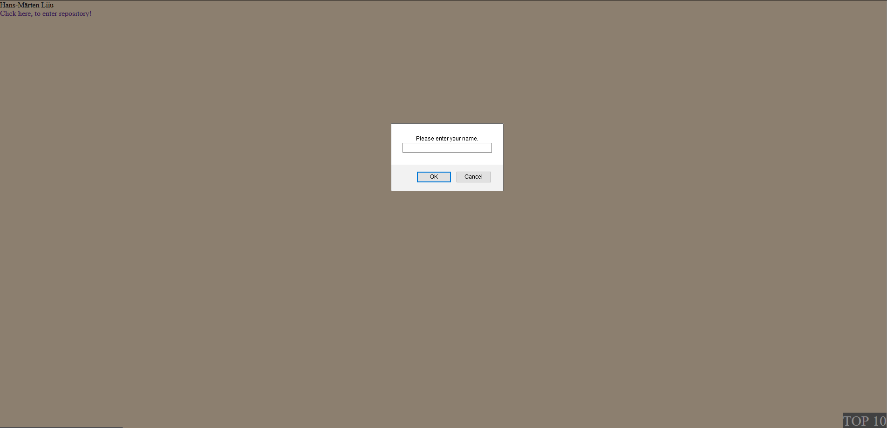
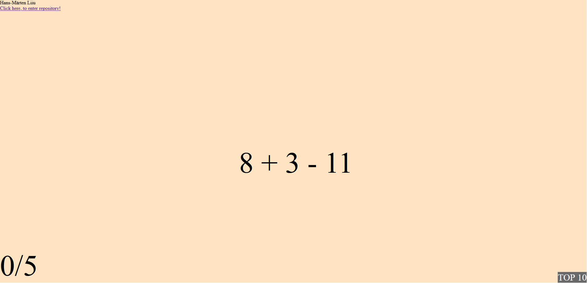
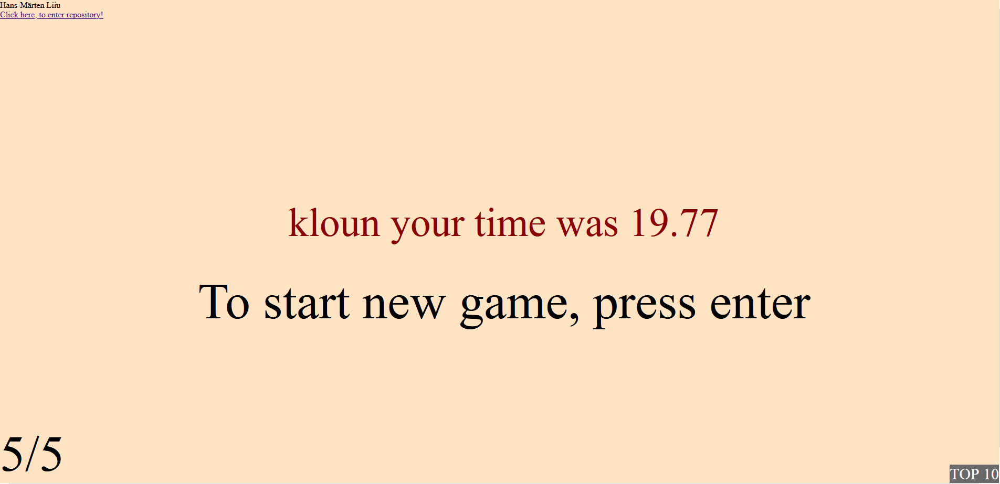
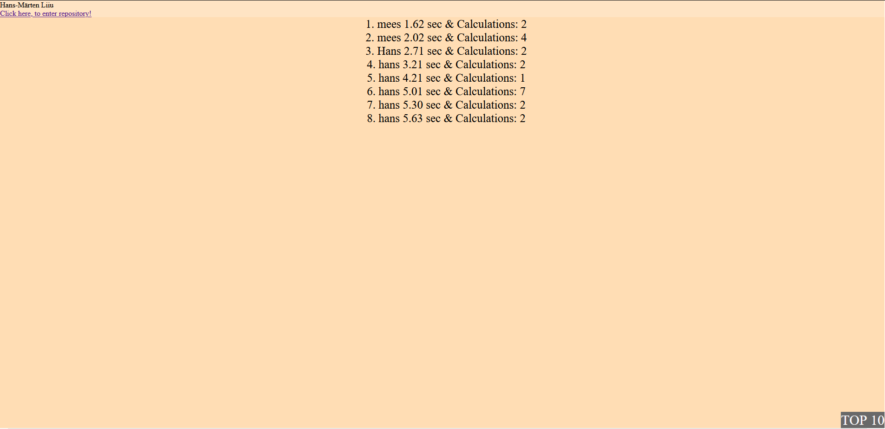

# Autor: Hans-Märten Liiu
 [http://greeny.cs.tlu.ee/~hanslii/2-kodutoo/Calculations.html](http://greeny.cs.tlu.ee/~hanslii/2-kodutoo/Calculations.html)

## Funktsionaalsused_1
* K6igepealt tuleb sisestada m2ngija nimi, see j2rel mitu tehet arvutada soovid.
* Kui tehete arv j22b sisestamata, siis default arv on 2.
* M2ng hakkab kohe pihta.
* Tekib tehe ekraanile ning j2rgmisele tehtele liikumiseks tuleb sisestada 6ige vastus.
* Kui m2ng l6ppeb saab soovi korral enteriga m2ngu uuesti alustada.
* All vasakul on kirjas mitmes tehe on parasjagu k2sil.
* Paremal all on v6imalik n2ha scoreboardi, mis on salvestatud database.txt faili ja sealt laetakse local storagesse.

## Kuvatõmmised

