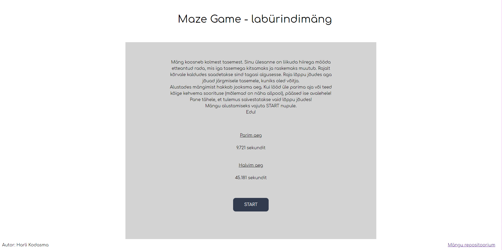
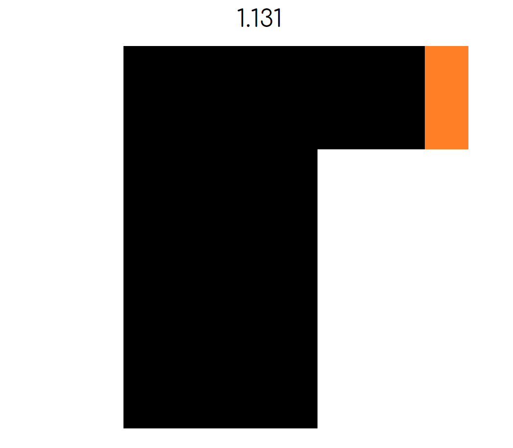
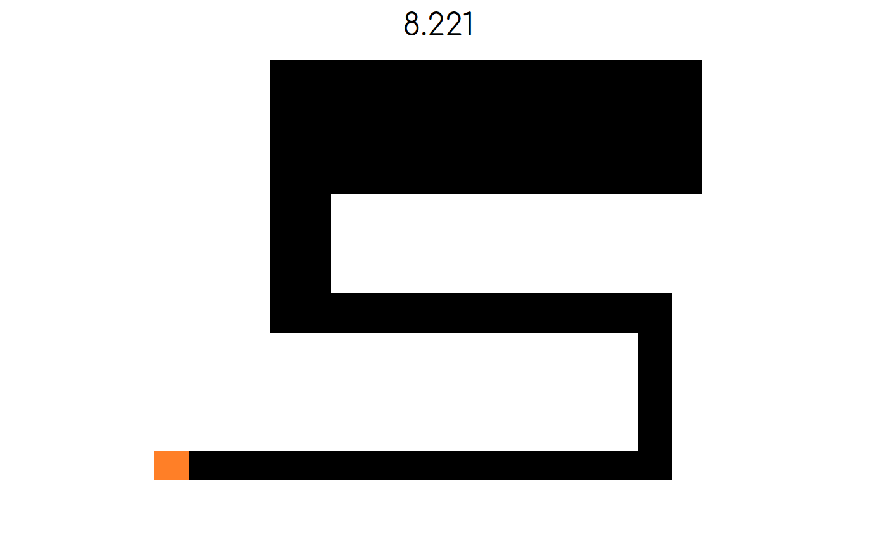
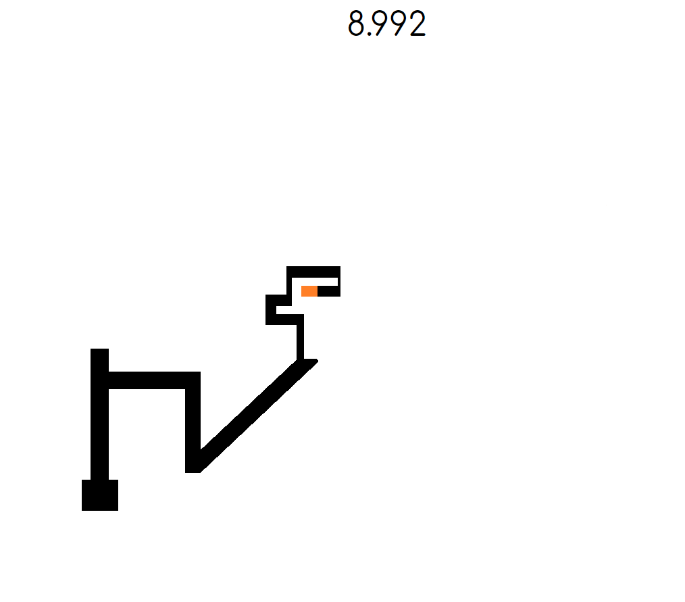
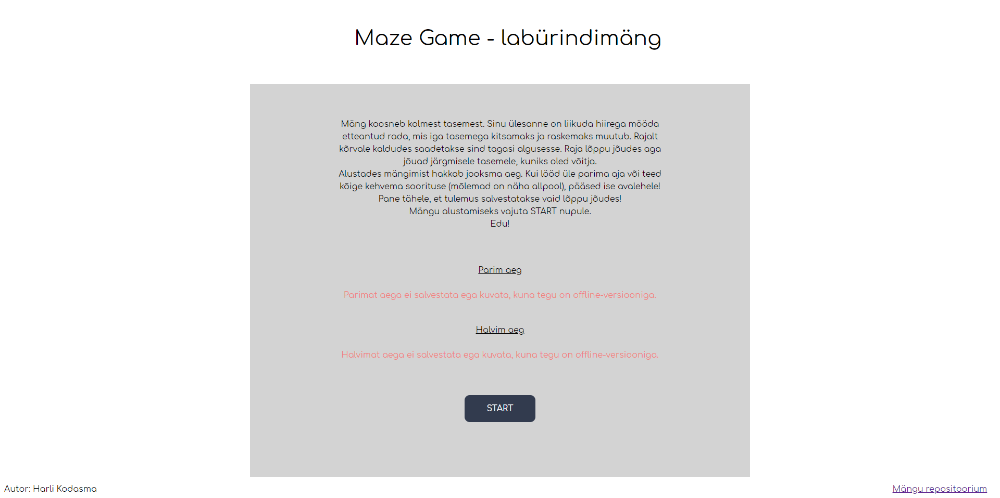

# 2. kodutöö

## Autor ja veebileht

Autor: Harli Kodasma  
"Offline" versioon (ilma PHPta ehk aja salvestamine ei tööta): http://www.tlu.ee/~harli17/eesrakendused/kodutoo2/
Täielikult funktsionaalne versioon (vajab tunnelit): http://greeny.cs.tlu.ee/~harli/eesrakendused/kodutoo2/

## Funktsionaalsus

Tegu on labürindimänguga (Maze Game). Ülesandeks on liikuda hiirega mööda etteantud rada läbi kõigi tasemete, mida on kokku 3. Iga tasemega läheb rada kitsamaks ja raskemaks. Rajalt välja minnes tehakse lehele _force reload_ ehk alustad algusest.
* Mängu alustades hakkab jooksma aeg. Mängu võites salvestatakse aeg AJAXi ja PHP abil serverisse ning esilehel kuvatakse kõige paremat ja kõige halvemat aega, millega mäng on lõpetatud (aeg salvestatakse vaid mängu lõpetamisel, rajalt lahkudes seda ei juhtu). Mängides "offline" versiooni kuvatakse aegade juures, et see pole kahjuks võimalik ning online versioonis töötab asi kenasti.
* Loodud on kerge _anti-cheat_ süsteem, nimelt raja algusest oleks raja lõppu võimalik üsna lihtsasti pettusega saada. Kui vajutada paremat hiireklahvi, ilmub menüü mis deaktiveerib canvase millel mäng jookseb ja saab liigutada hiire raja lõppu ilma, et tuvastussüsteem saaks rajalt lahkumisest aru. Selle vältimiseks olen kogu lehel eemaldanud võimaluse paremklikki teha, seega **peaks** parim tulemus olema saavutatud ausal teel.

## Märkused

* DISCLAIMER: Kes veel aru ei saanud, siis tegu on järgitehtud Scary Maze mänguga ehk tegelikult "päris" lõpuni pole võimalik jõuda, veidi enne lõppu ilmub _jumpscare_ ehk valju heli ja "hirmus" pilt - see ongi kogu mängu mõte.
* Mõne inimese jaoks ei tööta mäng Firefox brauseriga (kogu mäng on väga _unresponsive_ ja aken _stutter_ib). Ei suutnud välja selgitada põhjust - töötab brauseritel Brave, Chrome, Edge (Chromium), Opera.
* On ka JS failis kommentaarina välja toodud, aga on kasutatud koodi antud lehelt: https://ourcodeworld.com/articles/read/185/how-to-get-the-pixel-color-from-a-canvas-on-click-or-mouse-event-with-javascript
Laenatud koodi on muudetud vastavalt vajadusele ning selle eesmärk on teha ära _hit detection_ töö antud mängus. Ise sellist asja välja mõelda ega tööle panna ei suutnud ning leidsin sobiva valmis lahenduse, mis aga vajas päris hulga tööd, et enda olukorras tööle saada.
* Mängus on kasutatud nii jQuery't kui ka vanilla JSi põhjusel, et kõiki asju ei saanud teha näiteks jQuery selectoritega nii, nagu seda saab teha vanilla JSiga.
* Samuti on osa koodist väljaspool klassi ehk mitte-OOP, kuna neid osasid ei ole kas võimalik klassi sees normaalselt tööle saada või ei leidnud ma lihtsalt sellist lahendust, mis seda suudaks. Võimalikult palju aga panin asju siiski klassi.
* Greenys ehk "online" versioonis asju testides (näiteks kas parim aeg ikka muutub, kui see üle lüüa) tasub meeles pidada kasutada CTRL+F5, sest ka endal arenduse käigus oli palju probleeme, kui unustasin seda teha ja ei saanud aru, miks asjad ei tööta.
* Esialgu üritasin teha kodutööks üldse Simon Game, aga peale umbes 10 tundi arendust tekkisid probleemid millest ei saanud jagu ka googeldades, andsin alla ja alustasin selle mänguga. Ka see mäng võttis ligikaudu 10 tundi algusest lõpuni aega, et valmis saada, kuna esines igat sorti erinevaid probleeme, mille lahendamine võttis väga erinevalt aega.

## Ekraanipildid rakendusest

### Täielikult funktsionaalne avavaade

### Esimene tase

### Teine tase

### Kolmas tase

### "Offline" versiooni avavaade

