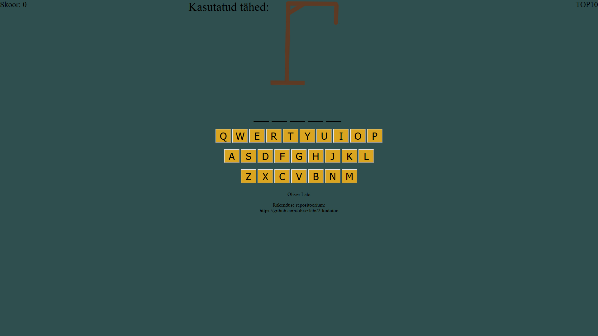
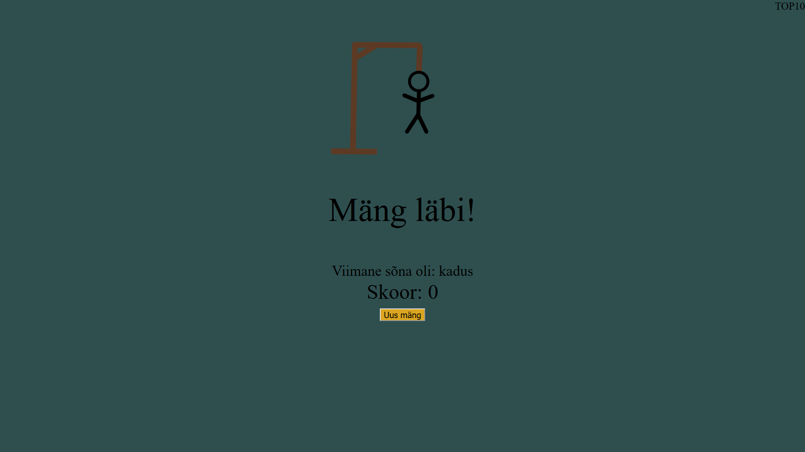
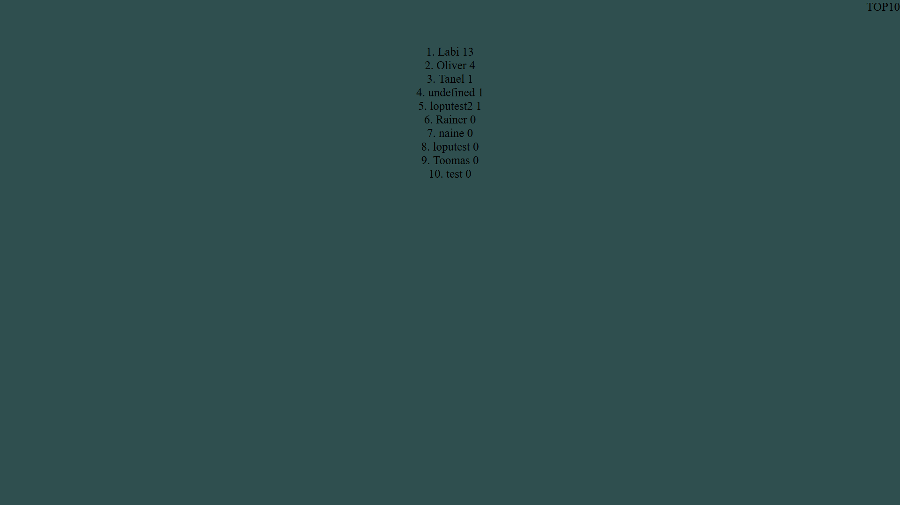

Autor: Oliver Labi

Funktsionaalsus

Klassikaline poomismäng

Mäng on eesti keelne. Tähti saab sisestada vajutades ekraanil olevatele klaviatuurinuppudele.

Lubatud on 6 viga. Kui sooritada 6 viga, siis mäng viskab ekraani ette, kus saad uuesti mängu alustada.

Viga sooritades vahetuvad kriipsujuku pildid.

Iga kord, kui sisestada täielik sõna, siis vigade arv läheb nulli ning skoorile tuleb +1.

Nurgas on TOP10 nupp, mida vajutades näeb TOP 10 tulemust. Edetabel on toimiv ning tehtud AJAXiga. 

